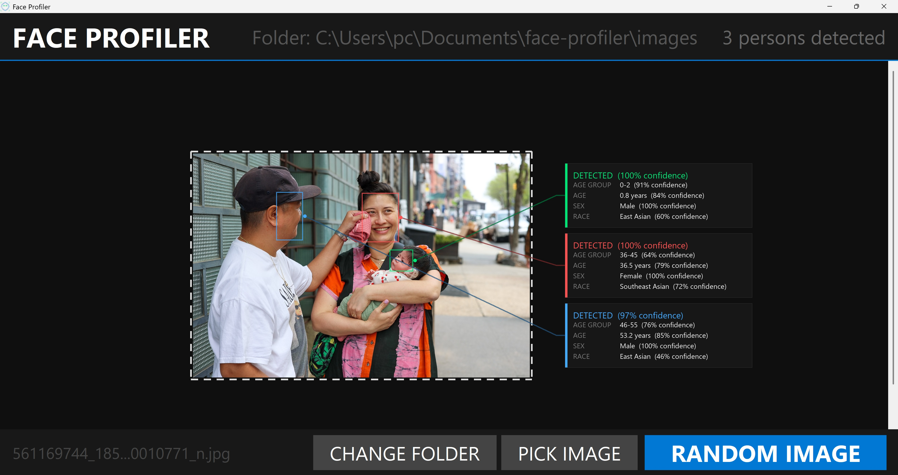

# Face Profiler



Face detection and demographic analysis (age, gender, race) using MiVOLO v2 + FairFace + RetinaFace. Use it as a **Python library**, from the **command line**, or through the **GUI demo**. All inference runs locally.

## Quick start

```shell
git clone https://github.com/m-a-x-c/face-profiler.git
cd face-profiler
pip install .          # installs all dependencies automatically
```

For **GPU acceleration** (recommended), install PyTorch with CUDA separately:

```shell
pip install --force-reinstall torch torchvision --index-url https://download.pytorch.org/whl/cu128
```

Models (~500MB total) are downloaded automatically on first run and cached locally.

### Python library

```python
from face_profiler import FaceProfiler

profiler = FaceProfiler()          # device auto-detected; models load lazily
results = profiler.analyze("photo.jpg")

for face in results:
    print(f"{face['gender']}, age {face['age']:.0f} ({face['age_range']}), {face['race']}")

# Save an annotated image with boxes and info cards
annotated = profiler.render("photo.jpg")
annotated.save("output.jpg")
```

Each result dict contains:

```python
{
    "box": (x1, y1, x2, y2),
    "confidence": 0.98,
    "age": 24.3,
    "age_range": "18-25",
    "gender": "Female",
    "gender_confidence": 97.2,
    "race": "East Asian",
    "race_distribution": {"White": 2.1, "Black": 0.3, ...},
}
```

### Command line

```shell
face-profiler photo.jpg              # JSON output
face-profiler photo.jpg --text       # Human-readable output
face-profiler photo.jpg --annotate output.jpg
face-profiler photo.jpg --device cpu
face-profiler --gui                  # Launch the GUI demo
```

Or via module:

```shell
python -m face_profiler photo.jpg
python -m face_profiler --gui
```

### GUI demo

```shell
face-profiler --gui
```

- **RANDOM IMAGE** — picks a random image from the current folder and analyzes it
- **PICK IMAGE** — opens a file picker to select any image from anywhere on disk
- **CHANGE FOLDER** — switch the image folder (default is `images/`)

## GPU support (recommended)

For other CUDA versions, see https://pytorch.org/get-started/locally/

Verify GPU is detected:

```shell
python -c "import torch; print(torch.cuda.is_available(), torch.cuda.get_device_name(0) if torch.cuda.is_available() else 'CPU')"
```

## Project structure

```
face-profiler/
├── face_profiler/              # Python package
│   ├── __init__.py             # Public API (FaceProfiler)
│   ├── __main__.py             # CLI entry point
│   ├── core.py                 # FaceProfiler class
│   ├── models.py               # Model loading and prediction
│   ├── detection.py            # Face detection and cropping
│   ├── constants.py            # Labels, thresholds, age ranges
│   ├── rendering.py            # Annotated image rendering
│   └── gui.py                  # Tkinter GUI demo
├── mivolo/                     # MiVOLO package (cloned from GitHub)
├── images/                     # Default image folder
├── pyproject.toml              # Packaging config
├── requirements.txt
└── README.md
```

## Model stack

| Stage | Model | What it does | Accuracy |
|-------|-------|-------------|----------|
| Detection | RetinaFace | Finds faces, returns bounding boxes + confidence | 0.7 confidence threshold |
| Age | MiVOLO v2 | SOTA age estimation trained on large-scale age-diverse datasets including children, teens, adults, and elderly | ~3.65 MAE |
| Gender | MiVOLO v2 | Gender classification with confidence score | ~98% accuracy |
| Race | FairFace (ResNet34) | 7-class race classification trained on balanced, diverse dataset | Outputs dominant race with confidence |

### Pipeline rules

- Faces smaller than 40px are rejected (too small for reliable analysis)
- Detection confidence threshold: 0.7
- Age is shown as both a group estimate (e.g., "13-17") and exact estimate (e.g., "14.6 years")
- All predictions include confidence percentages
- Face crops are expanded by 20% before analysis for better context
- Each detected person gets a distinct color with leader lines to info cards

### Model downloads (automatic on first run)

| Model | Size | Source |
|-------|------|--------|
| MiVOLO v2 | ~300MB | HuggingFace (`iitolstykh/mivolo_v2`) |
| FairFace ResNet34 | ~85MB | Google Drive (original FairFace authors) |
| RetinaFace | ~100MB | Cached by retinaface package |

All models are cached locally after first download. No API calls during inference.

### FairFace race classes

White, Black, Latino/Hispanic, East Asian, Southeast Asian, Indian, Middle Eastern

## Notes

- First run is slow — models are downloaded and cached. Subsequent runs are fast.
- GPU (CUDA) speeds up inference substantially but CPU works fine.
- All inference runs locally on your machine.
- HiDPI / 4K displays are supported with automatic scaling.
